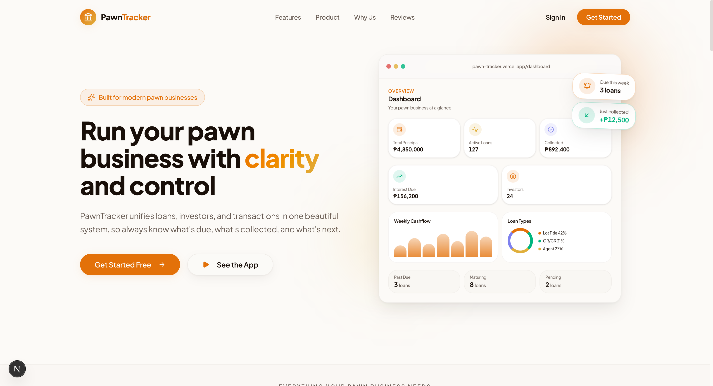
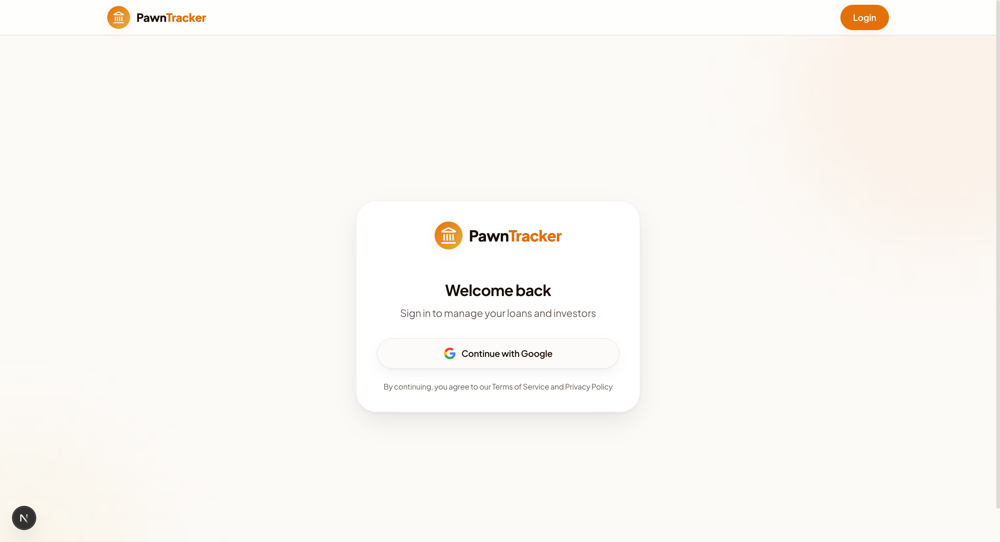
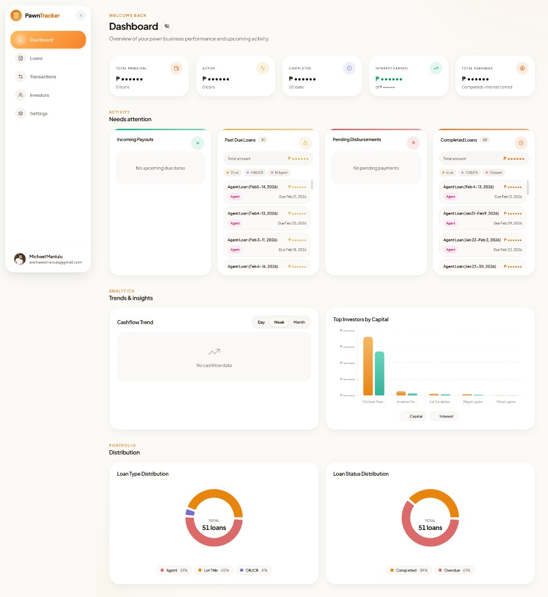
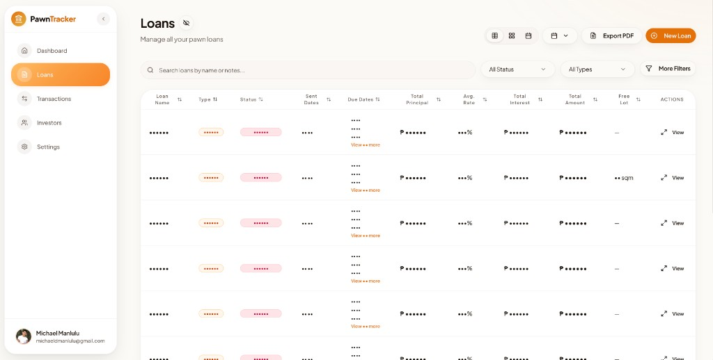
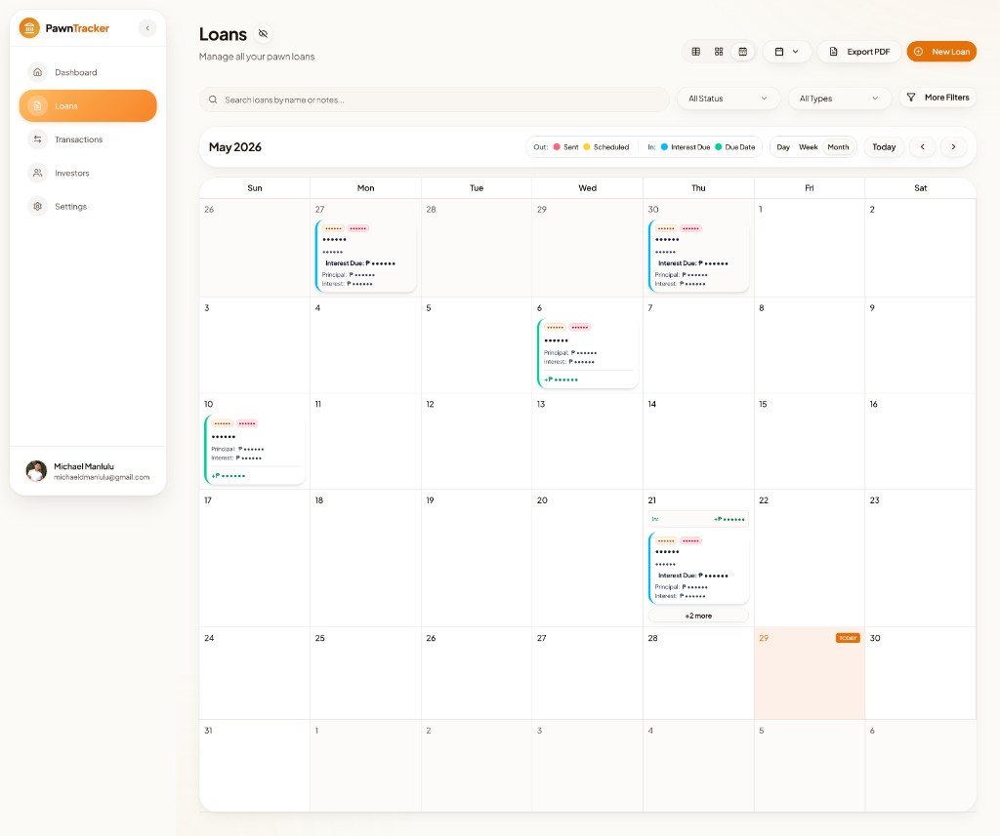
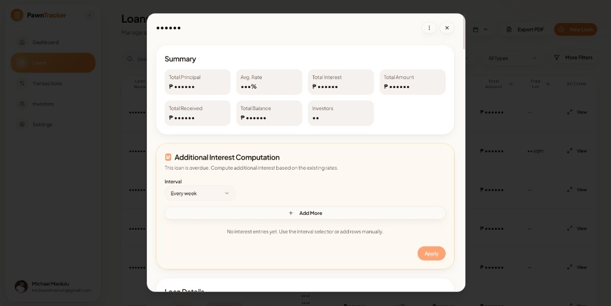
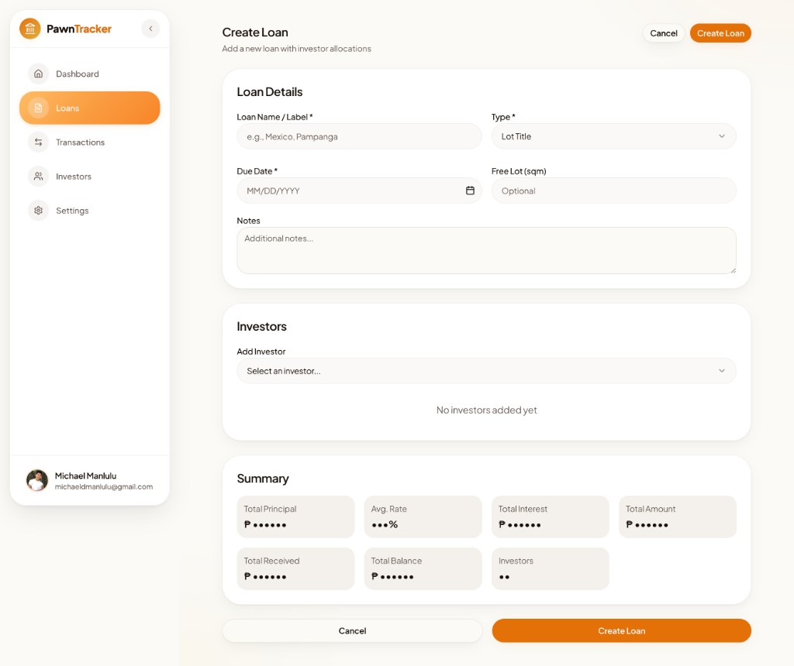
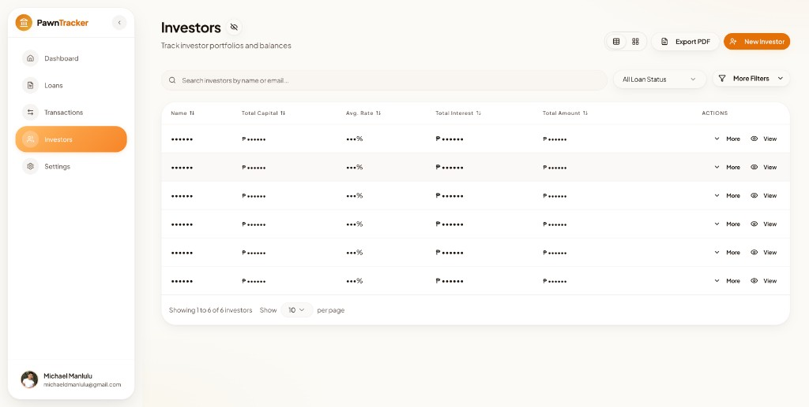
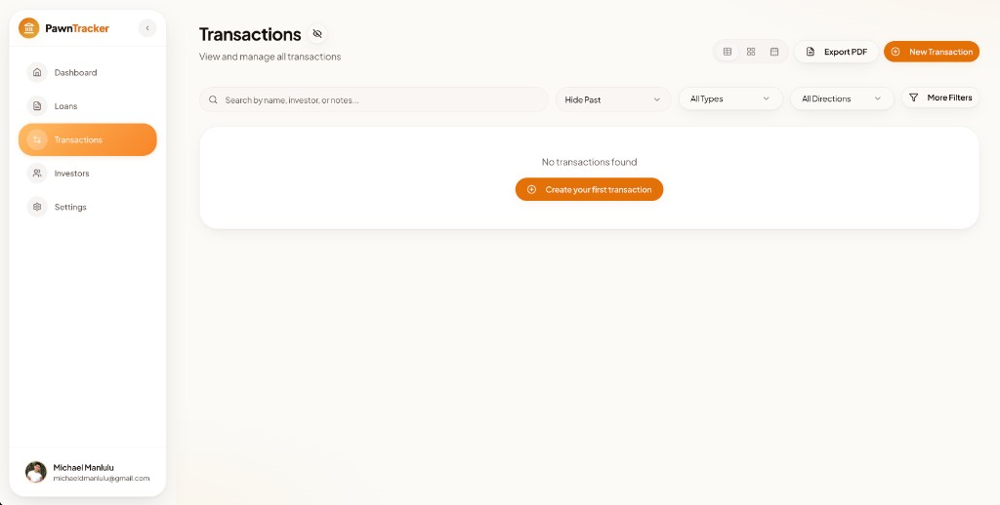

# PawnTracker

**A modern web app for pawn businesses to manage loans, investors, and cashflow in one place.**

Built with Next.js 15, React 19, and a polished UI for day-to-day operations — from recording Lot Title / OR/CR / Agent loans to tracking investor participation, interest periods, and collections. Hosted on **Vercel**, backed by **Neon** serverless Postgres, with **Google sign-in** for access and optional **Google Calendar** sync for disbursements, due dates, and daily summaries.

<p align="center">
  
</p>

<p align="center">
  <a href="#features">Features</a> ·
  <a href="#screenshots">Screenshots</a> ·
  <a href="#tech-stack">Tech Stack</a> ·
  <a href="#getting-started">Getting Started</a>
</p>

<p align="center">
  
  
  
  
  
  
  
  
  
</p>

---

## Features

### Loans

- Create and manage **Lot Title**, **OR/CR**, and **Agent** loans
- Multi-investor allocation with per-investor principal, rates, and schedules
- **Multiple interest periods**, received payments, and overdue handling
- In-app calendar, table, and card views with filters and sorting
- Duplicate loans, PDF/CSV export, and manual Google Calendar sync from settings

### Investors

- Investor directory with capital, returns, and active loan counts
- **Investor portal**: share loans via investor email (Google sign-in)
- Role-based access (`admin` vs `investor`)

### Transactions & dashboard

- Transaction ledger (collections, disbursements, returns)
- Dashboard with summary metrics, cashflow charts, and activity cards
- Past due, maturing, pending disbursement, and completed loan panels
- **Privacy toggle** to hide sensitive data (names, amounts, dates, rates, counts) across the app

### Google sign-in (OAuth)

- **Sign in with Google** via [NextAuth.js v5](https://authjs.dev/) — no passwords stored in the app
- Sessions persisted with the Drizzle adapter (`users`, `accounts`, `sessions`)
- **Role-based access**: `admin` (full workspace) and `investor` (shared loans & transactions)
- **Investor portal**: link investors by email so they sign in with the same Google account and see assigned loans

### Google Calendar integration

Optional sync powered by a **Google Cloud service account** and the Calendar API (`googleapis`):

- **Disbursement events** on principal sent dates, with investor breakdown
- **Due date events** with principal and interest totals
- **Interest due events** for loans with multiple interest periods
- **Daily summary events** aggregating in/out flows per day, with links back to filtered loans in the app
- **Manual sync** from the app (bulk sync / cleanup) — calendar updates are not forced on every loan save
- Investor emails can be added as attendees on events (when configured)

Requires `GOOGLE_SERVICE_ACCOUNT_EMAIL`, `GOOGLE_SERVICE_ACCOUNT_PRIVATE_KEY`, and `GOOGLE_CALENDAR_ID` in `env.example`.

### Operations & data

- JSON backup download and optional daily email backups (Resend + cron)
- Maintenance tools: sync due dates, fix received-payment totals

---

## Screenshots

| Landing | Sign in |
|:---:|:---:|
|  |  |

### App previews

Screenshots from the live app. Several views show the **privacy toggle** (eye icon) hiding names, amounts, dates, and rates.

| Dashboard | Loans (table) |
|:---:|:---:|
|  |  |

| Loans (calendar) | Loan detail |
|:---:|:---:|
|  |  |

| Create loan | Investors |
|:---:|:---:|
|  |  |

| Transactions |
|:---:|
|  |

---

## Tech Stack

| Layer | Technology |
|--------|------------|
| Framework | [Next.js 15](https://nextjs.org/) (App Router) |
| UI | [React 19](https://react.dev/), [Tailwind CSS 4](https://tailwindcss.com/), [shadcn/ui](https://ui.shadcn.com/) |
| **Authentication** | [NextAuth.js v5](https://authjs.dev/) + **Google OAuth** ([`auth.ts`](./auth.ts)) |
| **Calendar** | [Google Calendar API](https://developers.google.com/calendar) via [`googleapis`](https://www.npmjs.com/package/googleapis) + service account ([`lib/google-calendar.ts`](./lib/google-calendar.ts)) |
| **Database** | [Neon](https://neon.tech/) PostgreSQL (serverless) + [`@neondatabase/serverless`](https://www.npmjs.com/package/@neondatabase/serverless) |
| **Hosting** | [Vercel](https://vercel.com/) (serverless Next.js, cron, env config) |
| ORM | [Drizzle ORM](https://orm.drizzle.team/) |
| Forms | React Hook Form + Zod |
| Charts | Recharts |
| PDF export | `@react-pdf/renderer` |
| Email (optional) | Resend |

---

## Getting Started

### Prerequisites

- [Bun](https://bun.sh) or Node.js 20+
- A [Neon](https://neon.tech) PostgreSQL database
- [Google Cloud](https://console.cloud.google.com/) project with:
  - **OAuth 2.0** credentials (Web application) for sign-in
  - **Calendar API** enabled + **service account** (optional, for calendar sync)

### 1. Clone and install

```bash
git clone https://github.com/sprmke/pawn-tracker.git
cd pawn-tracker
bun install   # or: npm install
```

### 2. Environment variables

```bash
cp env.example .env.local
```

Fill in at minimum:

| Variable | Description |
|----------|-------------|
| `DATABASE_URL` | Neon connection string (`?sslmode=require`) |
| `AUTH_SECRET` | Random secret — `openssl rand -base64 32` |
| `AUTH_GOOGLE_ID` | Google OAuth client ID |
| `AUTH_GOOGLE_SECRET` | Google OAuth client secret |

**Google Calendar (optional)**

| Variable | Description |
|----------|-------------|
| `GOOGLE_SERVICE_ACCOUNT_EMAIL` | Service account email from Google Cloud |
| `GOOGLE_SERVICE_ACCOUNT_PRIVATE_KEY` | Service account private key (JSON key file) |
| `GOOGLE_CALENDAR_ID` | Target calendar ID (`primary` or shared calendar ID) |
| `NEXT_PUBLIC_APP_URL` | App URL for links inside calendar event descriptions |

**Other optional:** backups (`RESEND_API_KEY`, `BACKUP_EMAIL`, `CRON_SECRET`). See `env.example` for the full list.

### 3. Database

```bash
bun run db:push
```

If you upgrade an older database and see missing column errors, run `db/migrations/0001_interest_incomplete_and_period_link.sql` in the Neon SQL editor (see comments in that file for Postgres version notes).

### 4. Run locally

```bash
bun run dev
```

Open [http://localhost:3000](http://localhost:3000). Sign in with Google to access the dashboard.

---

## Scripts

| Command | Description |
|---------|-------------|
| `bun run dev` | Development server (Turbopack) |
| `bun run build` | Production build |
| `bun run start` | Start production server |
| `bun run db:push` | Push schema to Neon |
| `bun run db:generate` | Generate Drizzle migrations |
| `bun run db:migrate` | Run migrations |
| `bun run db:studio` | Open Drizzle Studio |

---

## Project structure

```text
app/                 # Routes (dashboard, loans, investors, transactions, API)
components/          # UI, feature modules, landing page
db/                  # Drizzle schema and SQL migrations
hooks/               # Shared React hooks (filters, pagination, sorting)
lib/                 # Calculations, formatting, calendar, PDF/CSV export
docs/screenshots/    # README and portfolio images
```

---

## License

MIT — see [LICENSE](LICENSE) if present, or use this project as a portfolio reference with attribution.

---

<p align="center">
  Built for pawn operators who want clarity on loans, investors, and cashflow — without spreadsheets.
</p>
